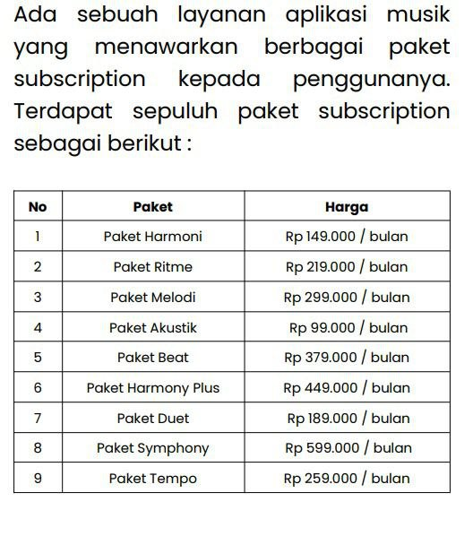
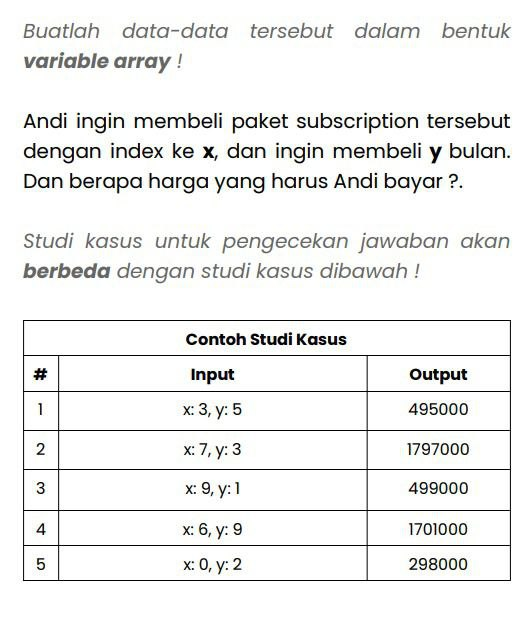

# QUIZ ARRAY - SAEPULFARIZ

Implementasi javascript and php base web version.
Visit web https://saepulfariz.github.io/quiz_array/

# DOCUMENTASI VIDEO

1. Part 1 https://www.youtube.com/watch?v=BlUBsJNUJ0U
2. Part 2

# IMPLEMENTASI

1. `git clone https://github.com/saepulfariz/quiz_array.git` in folder htdocs
2. Start `apache XAMPP` or open `quiz_array` then open CMD `php -S localhost:80`
3. visit http://localhost/quiz_array for html version.
4. visit http://localhost/quiz_array/php for php version.

# SOAL

